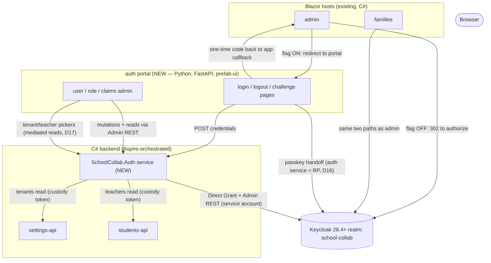

# Keycloak UI-End Authentication Integration

Date: 2026-09-22 · Provenance: owner decisions settled in a grill-me interview on 2026-09-22;
the decision record in §4 is **binding**. Grounding facts verified against `main` (cited as
`file:line` throughout). Companion surfaces: the portal conventions live in
`documents/specs/teachers-ward-portal-prefab-plan.md` and
`documents/solution/portals-service-client-pattern.md`.

## 1. Goal and context

Keycloak is integrated and working at the backend. The shared `AddAuthAndTenancy` registration
(`src/SchoolCollab.Core/Auth/AuthTenancyExtensions.cs`) wires cookie + OIDC (code flow) for the
Blazor hosts (`DefaultScheme = Cookie`, `DefaultChallengeScheme = OpenIdConnect`, `:85-86`) and
JWT bearer for the API hosts (`:112-129`). The AppHost imports a dev realm
(`src/AppHost/SchoolCollab.AppHost/school-collab-realm.json`) whose protocol mappers mint
`tenant_id`, `tenant_name`, `tenant_type` and `teacher_id` claims onto **both** the ID token
(cookie path — `GetClaimsFromUserInfoEndpoint = false`, `:110`) and the access token (bearer path,
`:124-128`), so `ICurrentUser` (`src/SchoolCollab.Core/Auth/CurrentUser.cs:35`) and the tenant
machinery (`ITenantProvider.cs:3,10`) resolve identity identically on both paths.

What does **not** exist is the UI end:

- **No login/logout surface anywhere.** There is no `/login` route, no `LoginDisplay`, and the
  OIDC handler's auto-mapped `/signin-oidc` is the only auth endpoint in either Blazor host.
- **Gating is host-level only.** With OIDC enabled, both hosts gate *all* their pages via a
  conditional `razorComponents.RequireAuthorization()` (`src/SchoolCollab.Admin/Program.cs:97-100`,
  `src/SchoolCollab.Families/Program.cs:136-139`); no per-page `[Authorize]` or `AuthorizeView` is in
  use (the only textual match is a comment, `Families/Components/Pages/Ward/Index.razor:9-12`).
  The moment OIDC is on, every page challenges — so *where the challenge lands* is exactly what
  this spec controls. Page-level code (components, `ICurrentUser`, claims) is unaffected either way.
- **No user/role/claims administration at all.** The realm file's top-level keys are exactly
  `clients, enabled, loginWithEmailAllowed, realm, registrationAllowed, sslRequired, users` — **no
  roles**, no service accounts, no flows, no required actions. No `RoleClaimType` is set
  (`AuthTenancyExtensions.cs:89-111`) and no `roles` claim is read anywhere. The only user is the
  seeded `dev-teacher`.

### Owner requirements (traceability targets)

| # | Requirement |
|---|---|
| **R1** | A login UI that connects to Keycloak — login, logout and challenge pages in a prefab auth portal, with the Blazor hosts redirecting to them |
| **R2** | Passwordless login as an option (passkeys on Keycloak 26.4+) |
| **R3** | A feature flag toggling Keycloak's hosted login UI vs a custom-designed prefab UI — a **pure UI toggle; security stays fully on in both states** |
| **R4** | An admin UI (prefab) for creating tenant users and managing their roles and claims |
| **R5** | All these UIs use prefab-ui; **all backend logic is C#/Aspire** |
| **R6** | Keycloak remains the central point of truth for identity in every scenario |

## 2. Out of scope / non-goals

- The existing Blazor hosts' Fluent-UI pages are untouched; only their challenge/login plumbing
  changes.
- The ward/teacher portals (`src/SchoolCollab.Portals`, the Phase-0 spike app) do **not** adopt the
  auth portal in this spec — the auth portal is built as its own project so they can adopt it later.
- No OIDC back-channel logout (deferred, §16).
- No runtime realm-role CRUD — role *definitions* stay declarative in the realm import (D11).
- The `FEATURE:DisableOIDCAuth` / `TestAuthHandler` dev bypass stays as-is for every **consuming**
  host; this spec's flag is orthogonal to it and **never** disables auth (D4). The sole carve-out is
  the **auth service**, which registers the OIDC **relying-party pipeline** (cookie + OIDC, with
  `TestAuth` still the default scheme) via an explicit `requireOidcRelyingParty` opt-in — D16 makes
  the auth service *the* relying party, so the bypass spares *consumers* from Keycloak without
  stripping the relying party of its challenge ability. *(Lands in pass 2.)*
- No changes to existing bounded contexts (settings/students/assignments) beyond consuming their
  existing read-only registries for pickers (§8).

## 3. Architecture overview

| Component | Stack | Owns |
|---|---|---|
| **auth portal** (new, e.g. `src/SchoolCollab.AuthPortal/`) | Python + FastAPI/uvicorn + prefab-ui, hosted solely by the AppHost (`AddUvicornApp`, mirroring `Program.cs:389`) | login/logout/challenge pages; the user/role/claims admin UI. Pure HTTP consumer — no business logic |
| **SchoolCollab.Auth** (new C# service) | C#/Aspire | the Direct-Grant exchange; the one-time-code handshake store; server-side token custody for portal sessions; the Keycloak Admin REST client (service account). The **only** component that touches user credentials and admin-privileged secrets |
| **Keycloak** (existing, upgraded) | container, realm import | identity, sessions, roles, passkeys — the central point of truth |
| **Blazor hosts** (existing) | C# | their own auth cookies; where the challenge redirects is selected by the flag |

## 4. Binding decisions

| # | Decision | Rationale |
|---|---|---|
| **D1** | A new prefab-ui auth-portal Python project (same pattern as `src/SchoolCollab.Portals`) owns the login, logout and challenge pages; the Blazor hosts redirect to it when the custom UI is enabled; the auth-admin UI lives in the same project; all backend logic stays C#/Aspire | The owner requires prefab-ui for these surfaces; the portals pattern (thin FastAPI app, `api/` + `views/`, AppHost-hosted) is the proven shape in this repo |
| **D2** | Scope of change: the Keycloak realm import, the Aspire AppHost, and C# code (one new service + endpoint groups). Existing bounded contexts untouched | Real auth cannot land portals-only; the freeze in the portal plan is lifted for exactly this surface |
| **D3** | Upgrade Keycloak from `quay.io/keycloak/keycloak:26.2` (`Program.cs:74`) to **26.4+** | Passkeys became officially supported only in 26.4 (Enable Passkeys toggle, conditional/modal UI, `Condition - credential` 2FA skip). On 26.2 passwordless needs a hand-authored `authenticationFlows` block that nothing would guard |
| **D4** | `FEATURE:DisableKeycloakLoginUi` toggles **which login UI renders**: OFF (default) = Keycloak's hosted page via the standard OIDC code flow; ON = the custom prefab form which collects username/password and submits it by API to Keycloak (Direct Grant). **Security stays fully on in both states — it is a pure UI toggle** | The owner's requirement verbatim; the flag never widens authorization or disables validation |
| **D5** | Flag mechanics: AppHost parameter `feature-flag-disable-keycloak-login-ui`, fanned out via `WithEnvironment("FeatureFlags__FEATURE__DisableKeycloakLoginUi", …)` to admin, families, the auth service and the portal; **read at startup**; default OFF | Auth pipelines are fixed at startup — the repo's own documented precedent for `DisableOIDCAuth` (`SchoolCollab.Admin/Program.cs`); fan-out precedent `requireAssignmentApproval` (`Program.cs:150`, `appsettings.json:24`) |
| **D6** | Flag-ON handshake for Blazor ("IdP facade"): the gated page redirects to the portal; the portal form POSTs credentials to the auth service; the auth service performs the Direct-Grant exchange (secret stays server-side); on success the portal redirects back to the calling app's callback with a **one-time, short-TTL, single-use code bound to the originating app's redirect URI**, issued only for a callback on the per-app allowlist (§14); the app redeems it at the auth service and signs in with its own cookie built from the same Keycloak claims. Flag OFF: the OIDC challenge redirects to Keycloak's authorize endpoint exactly as today | The OIDC code flow cannot be pointed at a custom page, so the handshake is the only way to honor "Blazor redirects to the prefab login pages" while Keycloak stays the identity authority |
| **D7** | A new dedicated C# service (`SchoolCollab.Auth`) owns the Direct-Grant exchange, the pending-token + one-time-code store, portal-session token custody, and the Keycloak Admin REST client (service account) | One custody point for credentials and admin-privileged secrets; the portal stays a pure HTTP consumer; no business context is polluted with credential handling |
| **D8** | The admin manages **tenant users** (not platform/system users). A new user is created in Keycloak and **bound** to (a) an existing tenant (tenant picker) and (b) an existing teacher row (teacher picker). Identity-only creation; no cross-context writes; `teacher_id` + tenant attributes always present | Keycloak = identity truth; teacher rows are business data owned by the Students context (existing management UI); `ICurrentUser`/`TenantProvider` keep working unchanged |
| **D9** | Keycloak **realm roles** are the single role model (e.g. `user-admin`, `platform-admin`), declared in the realm import, assigned via the admin UI. A `User Realm Role` mapper emits a flat `roles` claim on **both** ID and access tokens; `TokenValidationParameters.RoleClaimType = "roles"` is set on the OIDC **and** JwtBearer handlers. The auth service's Direct-Grant path builds the identical claims shape | Roles live in the IdP; `[Authorize(Roles=…)]` works immediately and ASP.NET Core policies are a later, zero-Keycloak-change additive layer; claim parity keeps flag-ON/OFF sessions indistinguishable |
| **D10** | "Claims" = the Keycloak user attributes the realm mappers expose (`tenant_id`, `tenant_name`, `tenant_type`, `teacher_id`), edited via the admin UI through the auth service | Those attributes *are* the claims the APIs consume; there is no second claims store |
| **D11** | Admin surface v1: user list/create/edit (attributes, credential reset), role **assignment** from the existing role set, claims/attributes editor. Realm-role **definitions** stay declarative in the realm import; runtime role CRUD is a later extension | Declarative role definitions stay reviewable and guarded by the realm-import architecture tests |
| **D12** | Portal session: a minimal **opaque session-id cookie** (HttpOnly, SameSite=Lax) — an unguessable random id carrying **no signature and no key material in Python**; the portal treats it as a routing hint only, and the auth service validates the session server-side on every identity or privilege-bearing call. Keycloak tokens for that session are stored **server-side in the auth service**; the portal uses them only via mediated auth-service endpoints (D17). Tokens never live in the browser or in Python state — with one named carve-out: a spent-token logout hint, the `id_token_hint` in the RP-initiated `end_session` URL (D13, option ii), present transiently as an opaque response field the portal never parses, logs or persists and in the browser's `end_session` URL, is not a credential the portal *holds*; the invariant that survives is **no token that grants or extends access** | Single custody point (D7); nothing credential-bearing in browser or Python state — not even a cookie-signing key (settled 2026-09-22: a signed cookie saves no hops over an opaque id and adds a Python secret); the only browser-visible token-shaped material is the spent-token `id_token_hint` logout hint (D13, option ii) |
| **D13** | Logout = standard **OIDC RP-initiated logout, settled as option (ii)**: the portal logout page clears its session; the auth service revokes the refresh token and returns the **fully-built `end_session` URL carrying `id_token_hint` + `post_logout_redirect_uri`**; the portal directs (302s) the browser to that URL and treats it as an **opaque string — never parsed, logged or persisted**. Blazor hosts use the OIDC handler's SignOut. Each app clears its own cookie; Keycloak kills the central SSO session. Back-channel logout deferred. **Option (iii)** — the auth service performing the browser-facing redirect itself — is **owner-rejected**; **option (iv)**, a permanently token-free logout, is the only shape that would keep the hint out of the browser URL | Uses the standard mechanism; revocation is defense-in-depth; the portal cannot *build* `end_session` itself because it never holds the id token (D12) — it only forwards the URL the auth service built, as an opaque value. (ii) settled by the owner; (iii) rejected, (iv) recorded |
| **D14** | Passwordless = passkeys on Keycloak 26.4+ (D3): WebAuthn Passwordless Policy "Enable Passkeys" ON; required action `WebAuthn Register Passwordless` enabled. The custom form keeps passwordless available via a **"Sign in with passkey"** button that hands off into the standard OIDC code flow — so passwordless works under **both** flag states; the custom UI replaces only the password path; the OIDC return is handled per **D16** (the auth service is the relying party) | WebAuthn cannot run inside a custom form; the hybrid handoff preserves R2 under both states |
| **D15** | **Provider seam**: Keycloak is the only auth provider now; the portal-facing operations (authenticate, session create/read/revoke, claims, refresh, logout) sit behind one interface in `SchoolCollab.Auth` with the Keycloak implementation behind it. Other IdPs (per-environment dev/beta/prod variance) are **future, additive implementations** — environment routing is configuration, not code. The Keycloak **Admin REST** surface stays explicitly Keycloak-specific (it *is* a Keycloak admin API); D3/D9/AC3 unchanged | Owner ruling 2026-09-22: keep Keycloak, defer other IdPs, structure for easy later integration. The portal→auth-service contract **is** the seam — the portal never learns which IdP is behind it |
| **D16** | **Passkey-path session bootstrap**: the portal's passkey button hands off into the standard OIDC code flow with the **auth service as the relying party** — its `redirect_uri`, never the portal's; the portal gets **no OIDC client in the realm**. The auth service completes the exchange in C# custody, creates the portal session, then redirects the browser to the portal with a **single-use, short-TTL, URI-bound bootstrap code** (same primitive as D6); the portal redeems it for its opaque session id. If the sign-in began at a gated Blazor page, the D6 one-time-code handshake to that app's callback continues from the same completed exchange | A portal-side code exchange would put tokens in Python (AC9); the auth service is already the custodian (D7) and the bootstrap primitive already exists (round A's `OneTimeCodeStore`) |
| **D17** | **Token-bearing reads are mediated** (settles §16.8): the portal performs **no direct HTTP call** to `settings-api`/`students-api` and never holds an API token. The auth service exposes typed read endpoints (tenants, teachers) that use the custody token server-side and return data only. **Recorded future direction, not round-B scope:** if direct reads ever become a hard requirement, the upgrade path is the auth service minting its own short-lived, audience-scoped token — making it a second issuer every API host must trust; rejected for round B as a repo-wide validation change with no portability gain over the mediated seam | Owner rulings 2026-09-22: the portal stays credential-free (AC9) and provider-agnostic (D15); the mediated seam already delivers the IdP-swap flexibility at a fraction of the blast radius |
| **D18** | **Session read & lifecycle**: the portal renders from the claim set as **data** (tenant, `teacher_id`, `roles`) obtained from a session read on the auth service — never tokens. The auth service refreshes tokens **transparently in custody**; a failed refresh (revoked/expired) returns a distinct **`session ended`** status, and the portal reacts by clearing its cookie and rendering an AC10 error card — never a half-working page | No credential in Python (D12/AC9); silent refresh failure produces the "logged in but nothing works" state, which hides revocation and is the worst UX |

## 5. Login flows

### 5.1 Flag OFF (default) — Keycloak hosted page

1. An unauthenticated request to a gated Blazor page triggers the OIDC challenge
   (`DefaultChallengeScheme = OpenIdConnect`): 302 to Keycloak's authorize endpoint.
2. Keycloak renders its hosted login page. On 26.4+ with passkeys enabled, conditional UI offers
   passkeys in the username field's autofill and a modal "Sign in with passkey" button; password
   login remains the fallback.
3. Keycloak returns the code to `/signin-oidc`; the handler builds the cookie identity from the
   ID-token claims (tenant + teacher + roles).
4. **The portal's own login is not this flow.** D16 removed the portal's OIDC client, so the
   portal's own login (its admin UI) is the **form + exchange** path under **both** flag states
   (§5.2) — the flag selects only which login UI the **Blazor hosts** present. The Blazor app
   login renders no custom form under flag OFF.

### 5.2 Flag ON — custom prefab form + handshake (D6)

1. A gated Blazor page redirects unauthenticated users to the auth portal's `/login?return_uri=<app
   callback URL>` (each host needs explicit login/logout endpoints — none exist today).
2. The portal renders the prefab login form. Submit POSTs the credentials **to the auth service**
   (`/auth/exchange`) — never directly to Keycloak, never to the browser.
3. The auth service performs the **Direct Grant** exchange against Keycloak's token endpoint using
   the confidential client (`directAccessGrantsEnabled: true` already on `school-collab-client`),
   with the client secret server-side. Keycloak verifies the credentials and issues real tokens.
4. On success the auth service stores the pending token/claim set bound to a **one-time code**
   (single-use, short TTL — e.g. ≤ 60 s — and bound to the originating app's redirect URI) and
   returns the code to the portal **together with its portal session id** (as built in round A) —
   the portal sets its D12 cookie immediately.
5. The portal redirects to `return_uri?code=<one-time code>`; the calling app redeems it at the
   auth service (`/auth/redeem`) and signs in with **its own cookie**, built from the same Keycloak
   claims the OIDC path would have produced — including `roles` (parity, D9).
6. Failure paths render prefab error cards at HTTP 200 (invalid credentials, disabled user,
   Keycloak unreachable) — the portals' fail-closed degraded-state pattern — never a raw 500.

### 5.3 Passkey hybrid (D14)

The custom form carries a **"Sign in with passkey"** button. Pressing it hands off into the
standard OIDC code flow (redirect to Keycloak's authorize endpoint) with the **auth service as
the relying party** (D16) — the portal itself has no OIDC client, so no authorization code or
token can ever land in Python. Keycloak's 26.4+ conditional UI performs the WebAuthn ceremony;
the return hits the auth service, which completes the exchange in custody, creates the portal
session, and hands the portal a single-use bootstrap code redeemable for its session id — and,
if the sign-in began at a gated Blazor page, continues the D6 handshake to that app's callback.
Passwordless therefore remains available under **both** flag states; the custom UI replaces only
the *password* path.

### 5.4 Challenge and error pages

The portal owns the challenge page (session-expired re-authentication, post-logout continuation)
and all auth error surfaces, rendered as prefab views. Degraded states (auth service unreachable,
Keycloak unreachable) degrade to error cards, mirroring the portals pattern
(`documents/solution/portals-service-client-pattern.md`).

## 6. Passwordless (passkeys)

- Requires the D3 image bump: `quay.io/keycloak/keycloak:26.2` → **26.4+**
  (`src/AppHost/SchoolCollab.AppHost/Program.cs:74`).
- Realm config (declarative, §11): WebAuthn Passwordless Policy → **Enable Passkeys** ON; Passkey
  Mediation `conditional` (default; `optional` if an on-load prompt is wanted); required action
  **`WebAuthn Register Passwordless`** enabled. On 26.4+ the default browser flow needs no manual
  edits — passkeys integrate into the existing Username Password Form, and the new
  `Condition - credential` execution skips 2FA when a passkey was used.
- Enrollment: self-service via the Keycloak account console (`/realms/school-collab/account` →
  Signing In → passwordless section) **and** admin-assignable (required action on a user) from the
  admin UI (§8).
- **Secure-context constraint:** WebAuthn requires a secure context. `http://localhost` qualifies,
  so dev passkeys work against the dev Keycloak (plain `http://localhost:<ephemeral port>`, RP ID
  defaults to the Keycloak host). Any non-`localhost` plain-HTTP origin fails outright; production
  must be HTTPS with a matching RP ID.
- **Custom-form limitation (accepted):** WebAuthn cannot run inside the custom form — hence the
  §5.3 hybrid handoff. A user with only a passkey cannot sign in through the custom form itself.

## 7. Roles and ASP.NET Core policies

- **Keycloak is the single role model** (R6): realm roles (seed set: `user-admin`,
  `platform-admin`; extensible in the realm import) are defined and assigned only in Keycloak.
- A **`User Realm Role`** protocol mapper (same pattern as the existing tenant mappers) emits a
  flat `roles` claim with **`id.token.claim = true` and `access.token.claim = true`** (and
  userinfo) — this repo reads claims from the ID token on the cookie path
  (`AuthTenancyExtensions.cs:110`) and the access token on the bearer path (`:124-128`), so both
  must carry it.
- `AddAuthAndTenancy` sets `TokenValidationParameters.RoleClaimType = "roles"` on **both** the OIDC
  and JwtBearer handlers. The handler then surfaces role claims as `ClaimTypes.Role`, enabling
  `[Authorize(Roles = "user-admin")]` immediately.
- **Future ASP.NET Core policies are additive with zero Keycloak changes**:
  `services.AddAuthorization(options => options.AddPolicy("UserAdmin", p => p.RequireRole("user-admin")))`
  composes over the same claim. Role definitions and assignments remain Keycloak's; apps only read.
- **Parity requirement:** the auth service's Direct-Grant path (§5.2 step 5) must build the
  identical claim set (`roles` + tenant + `teacher_id`) so flag-ON and flag-OFF sessions are
  indistinguishable to `[Authorize]` and to `ICurrentUser`.

## 8. Admin UI surface (prefab, v1 — D8, D10, D11)

| Screen | Contents |
|---|---|
| **Users list** | Search by tenant / username; columns: username, tenant, roles, enabled |
| **Create user** | Username, initial credential (or reset-required), **tenant picker**, **teacher picker**, initial roles |
| **Edit user** | Attributes editor (`tenant_id`, `tenant_name`, `tenant_type`, `teacher_id` — the claims the mappers expose, D10), enable/disable, **credential reset** |
| **Roles** | Assign/unassign realm roles to a user. Role *definitions* are not editable at runtime (D11) |

- **Tenant picker** sources the existing read-only registry: `GET /api/tenants`
  (`src/Settings/SchoolCollab.Settings.Api/TenantEndpoints.cs:11,18`) — **mediated by the auth
  service** (D17): the portal calls a typed auth-service read endpoint and never reaches
  `settings-api` directly.
- **Teacher picker** sources teachers owned by the Students context (existing management UI:
  `Students.Application/Components/Pages/Teachers/`), likewise **mediated by the auth service**
  (D17). Identity-only creation (D8): the admin never writes teacher or tenant rows.
- All mutations go through the auth service's Keycloak Admin REST client (§13); the portal holds
  no admin-privileged credentials.
- The admin UI is itself gated: an authenticated session carrying the admin role (e.g.
  `user-admin`) — the first real use of role-based authorization in the repo.

## 9. Sessions and logout (D12, D13)

- **Portal session:** minimal **opaque** session-id cookie (HttpOnly, SameSite=Lax) — no
  signature, no key material in Python (D12); the portal treats it as a routing hint and the auth
  service validates the session server-side on every identity or privilege-bearing call. Keycloak
  tokens for that session live server-side in the auth service; the portal uses them only through
  mediated auth-service endpoints (D17). Tokens never reach the browser or Python state — with one
  named carve-out: a spent-token logout hint, the `id_token_hint` in the RP-initiated
  `end_session` URL (D13, option ii), present transiently as an opaque response field the portal
  never parses, logs or persists and in the browser's `end_session` URL, is not a credential the
  portal *holds*; the invariant that survives is **no token that grants or extends access**.
- **Session read & lifecycle (D18):** the portal renders from the claim set as **data** (tenant,
  `teacher_id`, `roles`) fetched from a session read — never tokens; the auth service refreshes
  tokens transparently in custody, and a failed refresh returns a distinct `session ended` status
  → the portal clears its cookie and renders an AC10 error card.
- **Logout (D13, option ii):** RP-initiated. The portal logout page clears its session cookie; the
  auth service revokes the session's refresh token at Keycloak's revocation endpoint and returns
  the **fully-built `end_session` URL carrying `id_token_hint` + `post_logout_redirect_uri`**; the
  portal 302s the browser to that URL and treats it as an **opaque string — never parsed, logged or
  persisted**. Building the URL stays in C# custody: the portal only forwards it. Option (iii) (the
  auth service performs the browser-facing redirect) is **owner-rejected**; option (iv) (a
  permanently token-free logout) is the only shape that would keep the hint out of the browser URL.
  Blazor hosts sign out through the OIDC handler's `SignOut` (same `end_session` URL with their own
  post-logout URI). Each app clears its own cookie on the way out; Keycloak terminates the central
  SSO session.
- **Deferred:** OIDC back-channel logout (§16).

## 10. The feature flag (D4, D5)

| Property | Value |
|---|---|
| Key | `FEATURE:DisableKeycloakLoginUi` (added to `src/SchoolCollab.Core/Features/FeatureFlagKeys.cs`) |
| AppHost parameter | `feature-flag-disable-keycloak-login-ui` (in the AppHost `appsettings.json` `Parameters:` block — precedent `feature-flag-require-assignment-approval`, `appsettings.json:24`) |
| Fan-out | `WithEnvironment("FeatureFlags__FEATURE__DisableKeycloakLoginUi", …)` to **admin**, **families**, the **auth service** and the **auth portal** (precedent `Program.cs:288,357`) |
| Read time | **Startup** — auth pipelines are fixed at startup (`DisableOIDCAuth` precedent documented in `SchoolCollab.Admin/Program.cs`) |
| Default | **OFF** — Keycloak's hosted UI is the default; the custom UI is the opt-in |
| Semantics | Pure UI toggle. Never disables auth, validation, or authorization in either state |

Documented per `.github/copilot/rules/configuration-documentation.md`: a new `Parameters:` entry
and `FeatureFlagKeys` row require the matching `documents/configuration.md` §2/§11 updates in the
same change set.

## 11. Keycloak realm import changes

All Keycloak config is **declarative** in `src/AppHost/SchoolCollab.AppHost/school-collab-realm.json`
— the container has **no data volume**, so the realm re-imports on every recreate and anything
configured only in the admin console is lost. Additions:

1. **Image bump** 26.2 → 26.4+ (`src/AppHost/SchoolCollab.AppHost/Program.cs:74`).
2. **`roles`**: realm roles `user-admin`, `platform-admin` (seed set; extensible).
3. **Service-account client** for the Admin REST client: confidential, `serviceAccountsEnabled:
   true`, client-credentials grant, granted `realm-management` client roles (at minimum
   `view-users`, `manage-users`, `view-realm`, `manage-realm`; exact set verified at
   implementation). Its secret is AppHost-managed like `keycloak-client-secret`.
4. **`User Realm Role` mapper** on `school-collab-client`: flat `roles` claim on ID + access tokens
   (§7).
5. **Passkeys**: WebAuthn Passwordless Policy → Enable Passkeys; required action
   `WebAuthn Register Passwordless` (§6).

**Guard constraints** (must stay green): `tests/SchoolCollab.ArchitectureTests.Unit/
AppHostRealmImportArchitectureTests.cs` enforces strict JSON (comments rejected), the
`<realm>-realm.json` filename derived from the file's own `realm` property, and the csproj copy +
bind-mount parity. Realm additions must respect all three.

## 12. AppHost changes

- Register the **auth service** (new C# project) with references to Keycloak's endpoint and the
  flag env var.
- Register the **auth portal** with `AddUvicornApp("auth-portal", …, "app:app")` — mirroring the
  portals block (`Program.cs:389-393`) — with `WithUv()`, references to the auth service (and the
  APIs the pickers read), and the flag env var.
- Add the `feature-flag-disable-keycloak-login-ui` parameter + fan-out to admin, families, the
  auth service and the portal (§10).
- Bump the Keycloak image (§11.1).

## 13. C# changes

- **New `SchoolCollab.Auth` service** (final naming at implementation) — the only component that
  handles credentials and admin-privileged secrets (D7):
  - `POST /auth/exchange` — credentials in (from the portal form), one-time code + portal session
    id + TTL out (as built in round A);
  - `POST /auth/redeem` — one-time code in, Keycloak claim/token set out (called by the Blazor
    callback);
  - portal-session custody, read & revocation endpoints (D12, D13, D18) — the session read
    returns the claim set as data; a failed refresh returns `session ended`;
  - passkey-path OIDC callback + portal bootstrap-code redemption (D16);
  - mediated picker reads: tenants and teachers, custody token server-side (D17);
  - Keycloak Admin REST proxy for the admin UI: users list/create/update, `reset-password`,
    `role-mappings/realm` assign/unassign, realm-roles read (§8). Paths per Keycloak Admin REST
    (`/admin/realms/{realm}/users…`) — verified at implementation.
- **`AddAuthAndTenancy`**: add `RoleClaimType = "roles"` to both the OIDC and JwtBearer handlers
  (§7).
- **Blazor hosts**: explicit login/logout endpoints that redirect to the auth portal when the
  flag is ON (none exist today — the OIDC handler's default challenge/signout already covers the
  flag-OFF path).

## 14. Security considerations

- **Direct Grant / ROPC risk — stated plainly and accepted by the owner.** `documents/configuration.md:370`
  warns that ROPC is deprecated (OAuth 2.1) and dev-only for hand-minted tokens. The custom-UI path
  uses the same grant deliberately, with mitigations that make it materially different from the
  browser-ROPC anti-pattern: the exchange is performed **server-side by a confidential C# client**
  (no client secret or token ever reaches the browser); credentials transit only portal → auth
  service over the AppHost network; the tokens are Keycloak-issued and validated as usual. Known
  costs accepted with D4/D6: the custom form is password-only (no in-form MFA/WebAuthn — §5.3
  hybrid), the form itself is a phishing surface (mitigate with antiforgery + rate limiting), and
  SSO across apps is established by the handshake rather than Keycloak's own browser session.
- **One-time code** (D6): single-use, short TTL, bound to the originating app's redirect URI;
  redemption is server-to-server between the calling app and the auth service.
- **Redirect-target allowlist (D6/D16 enforcement)** — a one-time code is minted only when the
  requested callback matches a per-app allowlist held in auth-service config
  (`Auth:AppCallbackPrefixes`): **exact scheme, host and port**, and a path that is either equal to
  the configured path or extends it **only at a `/` boundary** (so `…/signin-handshake-evil` is
  rejected while `…/signin-handshake?ReturnUrl=…` is accepted — query ignored, **userinfo
  rejected**), non-empty validated at startup (**fail-closed**). Enforced on the password path (`/auth/exchange`) **and** the
  passkey path (`/auth/passkey/*`) **before any code is issued**; the portal additionally
  re-validates `return_uri` before rendering or redirecting. Without it, a crafted
  `portal/login?return_uri=attacker` link would deliver an attacker-redeemable code carrying the
  victim's claim set — URI binding is defenceless when the attacker chooses the URI.
- **Sessions**: opaque session-id cookie only — no signing key in Python (D12); tokens
  server-side, and all token-bearing reads mediated (D17). Logout revokes refresh
  tokens and ends the Keycloak session (D13).
- **Admin surface**: gated by an admin realm role; all mutations audit-logged by the auth service.
- **Secrets**: the service-account secret and the client secret live AppHost-side like
  `keycloak-client-secret` today; nothing in Python state, nothing in the browser.

## 15. Verification and testing strategy

- **Architecture guards stay green**: `AppHostRealmImportArchitectureTests` (strict JSON, filename,
  bind-mount parity) plus the wiring guards (`AppHostSettingsDbWiringArchitectureTests`,
  `AppHostOutboxExchangeWiringArchitectureTests`) — a new-project AppHost block must not trip them.
- **Auth service unit tests**: exchange happy path + failure taxonomy (bad credentials, disabled
  user, Keycloak down); one-time-code semantics (single-use, TTL, redirect-URI binding); claim
  parity between the Direct-Grant claim set and the OIDC identity (incl. `roles` and tenant
  claims); Admin REST proxy request shapes.
- **Portal pytest**: routes + the auth client with a stubbed auth service via
  `app.dependency_overrides` (the existing portals test pattern), incl. degraded-state error
  cards. **Prefab form/input support must be verified first** — the Phase-0 spike exercised display
  components only (see §16).
- **Runtime cold-start checks** (Docker required): flag OFF → Keycloak hosted page renders, passkey
  conditional UI offered, sign-in reaches a gated Blazor page; flag ON → custom form → handshake →
  Blazor cookie established with identical claims; logout ends the Keycloak session; admin UI can
  create a tenant user and assign a role.

## 16. Open items and deferred

1. **Prefab-ui form/input component support** — **verified 2026-09-22** against the 0.20.2
   docs: `Input` (11 types incl. password; `required`/`minLength`/`maxLength`/`min`/`max`/
   `pattern`), `Form` with `on_submit`, `Form.from_model()` (Pydantic → labels, typed inputs,
   constraints, submit wiring), `Field`/`FieldError` with reactive `invalid`, `Select` (tenant
   picker), `Combobox` (searchable — teacher picker), `Checkbox`, `Switch`, `Textarea`, `Dialog`,
   `DataTable` (users list). REST wiring confirmed: the built-in **`Fetch.post(url, body=…)`**
   action submits JSON to the portal's own FastAPI routes (docs page "API Server — Wire Prefab
   apps to a REST backend with FastAPI"); wrapping inputs in a `Form` makes Enter submit. No MCP
   host is required. Design note: credentials transit browser → portal form → portal FastAPI →
   auth service; the portal never calls Keycloak directly (D6/D7 unchanged).
2. **Keycloak Admin REST exact paths and the minimal `realm-management` role set** — verify at
   implementation (F8-level detail is indicative, not authoritative).
3. **OIDC back-channel logout** — deferred (D13); RP-initiated logout ships first.
4. **Runtime realm-role CRUD** — deferred (D11); role definitions stay in the realm import.
5. **Ward/teacher portals adopting the auth portal** — out of scope here; the auth portal is a
   standalone project so adoption is a later, additive step.
6. **`NameClaimType` / display-name claim** — not decided; if wanted, it is an additive
   `AuthTenancyExtensions` change plus a mapper.
7. **Keycloak 26.4 image pin** — verify the exact 26.x tag/availability at implementation time.
8. **How the portal obtains per-request API access for the pickers** — **settled 2026-09-22 →
   D17**: the auth service mediates the reads; the portal never calls `settings-api`/
   `students-api` directly and never holds a token. The alternative (the auth service becoming a
   token issuer so the portal can call the APIs directly) was priced and rejected for round B;
   recorded as a future direction in D17.

## 17. Acceptance criteria

| # | Criterion |
|---|---|
| AC1 | With the flag **OFF**, a gated Blazor page redirects to **Keycloak's hosted** login page; sign-in produces a cookie whose claims (tenant, `teacher_id`, `roles`) match the pre-spec OIDC behavior |
| AC2 | With the flag **ON**, the same page redirects to the **auth portal's prefab form**; credentials POST to the auth service; the one-time-code handshake establishes the **same claim set**; the code is rejected on replay, after TTL, and for a mismatched redirect URI |
| AC3 | A **passkey** signs a user in under **both** flag states (flag OFF directly via conditional UI; flag ON via the hybrid button) |
| AC4 | Logout ends the Keycloak session, revokes the refresh token, and leaves no usable app cookie |
| AC5 | The admin UI (prefab) can create a tenant user bound to an existing tenant and an existing teacher row, assign a realm role, and edit its claim attributes — with **zero** writes outside Keycloak |
| AC6 | `[Authorize(Roles = "user-admin")]` (and a policy of the same shape) succeeds for a user holding the role and fails otherwise, identically on the cookie and bearer paths |
| AC7 | The flag is a pure UI toggle: with it **ON**, authorization, validation and tenancy behave exactly as with it **OFF** |
| AC8 | All Keycloak config is declarative in `school-collab-realm.json` (image 26.4+, roles, service-account client, `User Realm Role` mapper, passkeys policy) and `AppHostRealmImportArchitectureTests` stays green |
| AC9 | No credential, client secret, service-account secret, or Keycloak token is ever present in the browser or in Python state — with one named carve-out: a spent-token logout hint, the `id_token_hint` in the RP-initiated `end_session` URL (D13, option ii), present transiently as an opaque response field the portal never parses, logs or persists and in the browser's `end_session` URL, is not a credential the portal *holds*; the invariant that survives is **no token that grants or extends access** |
| AC10 | The auth portal degrades fail-closed: auth-service/Keycloak outages render prefab error cards at HTTP 200, never raw 500s |
| AC11 | The portal holds no credential that grants or extends access — no access token, no refresh token, no cookie-signing or other key material, no client or service-account secret — and performs no direct HTTP call to `settings-api`/`students-api`; every identity, privilege and token-bearing read is mediated by the auth service. The `id_token_hint` in the RP-initiated `end_session` URL is a logout hint over an already-spent token, not a bearer credential (D13, option ii) |
| AC12 | The flag-ON passkey path establishes a portal session without any authorization code or token reaching Python: the OIDC return lands on the auth service (D16) and the portal receives only a single-use bootstrap code, redeemable once for its session id |
| AC13 | A one-time code is issued **only** for a callback matching the per-app allowlist — on **both** the password and passkey paths — and a non-allowlisted `return_uri` is rejected with **no code in the response** (fail-closed); the portal re-validates `return_uri` before rendering |

### Requirement traceability

| Requirement | Where satisfied |
|---|---|
| R1 login UI connects to Keycloak | §3, §5, §13 |
| R2 passwordless option | §5.3, §6, D14 |
| R3 pure-UI-toggle flag | D4, D5, §10, AC7 |
| R4 admin for tenant users/roles/claims | D8, D10, D11, §8, AC5 |
| R5 prefab-ui + C#/Aspire backend | D1, D7, §3, §12, §13 |
| R6 Keycloak central point of truth | D3, D7–D10, §7, AC6, AC8 |